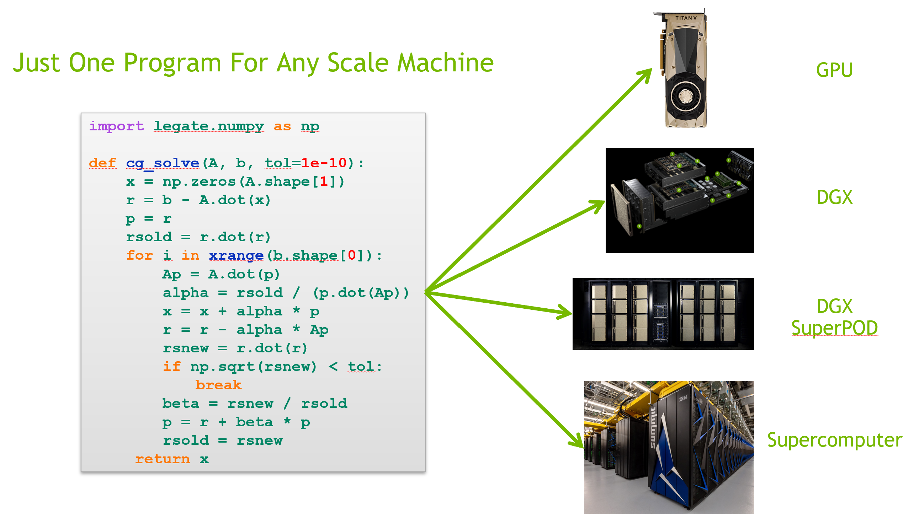

<!--
Copyright 2021-2022 NVIDIA Corporation

Licensed under the Apache License, Version 2.0 (the "License");
you may not use this file except in compliance with the License.
You may obtain a copy of the License at

    http://www.apache.org/licenses/LICENSE-2.0

Unless required by applicable law or agreed to in writing, software
distributed under the License is distributed on an "AS IS" BASIS,
WITHOUT WARRANTIES OR CONDITIONS OF ANY KIND, either express or implied.
See the License for the specific language governing permissions and
limitations under the License.

-->

# Legate 

The Legate project endeavors to democratize computing by making it possible
for all programmers to leverage the power of large clusters of CPUs and GPUs
by running the same code that runs on a desktop or a laptop at scale.
Using this technology, computational and data scientists can develop and test
programs on moderately sized data sets on local machines and then immediately
scale up to larger data sets deployed on many nodes in the cloud or on a 
supercomputer without any code modifications. In visual terms:



The Legate project is built upon two foundational principles:

1. For end users, such as computational and data scientists, the programming
   model must be identical to programming a single sequential CPU on their
   laptop or desktop. All concerns relating to parallelism, data 
   distribution, and synchronization must be implicit. The cloud or a 
   supercomputer should appear as nothing more than a super-powerful CPU core.
2. Software must be compositional and not just interoperable (i.e. functionally 
   correct). Libraries developed in the Legate ecosystem must be able to exchange
   partitioned and distributed data without requiring "shuffles" or unnecessary
   blocking synchronization. Computations from different libraries should be 
   able to use arbitrary data and still be reordered across abstraction boundaries 
   to hide communication and synchronization latencies where the original sequential 
   semantics of the program allow. This is essential for achieving speed-of-light
   performance on large scale machines.

The Legate project is still in its nascent stages of development, but much of
the fundamental architecture is in place. We encourage development and contributions
to existing Legate libraries, such as Legate NumPy and Legate Pandas, as well as 
the development of new Legate libraries. Pull requests are welcomed.

If you have questions, please contact us at legate(at)nvidia.com.

1. [Why Legate?](#why-legate)
1. [What is the Legate Core?](#what-is-the-legate-core)
1. [How Does Legate Work?](#how-does-legate-work)
1. [How Do I Install Legate?](#how-do-i-install-legate)
1. [How Do I Use Legate?](#how-do-i-use-legate)
1. [Other FAQs](#other-faqs)
1. [Contributing](#contributing)
1. [Documentation](#documentation)
1. [Next Steps](#next-steps)

## Why Legate?

Computational problems today continue to grow both in their complexity as well
as the scale of the data that they consume and generate. This is true both in 
traditional HPC domains as well as enterprise data analytics cases. Consequently,
more and more users truly need the power of large clusters of both CPUs and 
GPUs to address their computational problems. Not everyone has the time or 
resources required to learn and deploy the advanced programming models and tools
needed to target this class of hardware today. Legate aims to bridge this gap 
so that any programmer can run code on any scale machine without needing to be 
an expert in parallel programming and distributed systems, thereby allowing
developers to bring the problem-solving power of large machines to bear on 
more kinds of challenging problems than ever before.

## What is the Legate Core?

The Legate Core is our version of [Apache Arrow](https://arrow.apache.org/). Apache
Arrow has significantly improved composability of software libraries by making it
possible for different libraries to share in-memory buffers of data without 
unnecessary copying. However, it falls short when it comes to meeting two 
of our primary requirements for Legate:

1. Arrow only provides an API for describing a physical representation
   of data as a single memory allocation. There is no interface for describing
   cases where data has been partitioned and then capturing the logical 
   relationships of those partitioned subsets of data.
2. Arrow is mute on the subject of synchronization. Accelerators such as GPUs
   achieve significantly higher performance when computations are performed
   asynchronously with respect to other components of the system. When data is
   passed between libraries today, accelerators must be pessimistically 
   synchronized to ensure that data dependences are satisfied across abstraction
   boundaries. This might result in tolerable overheads for single GPU systems,
   but can result in catastrophically poor performance when hundreds of GPUs are involved.

The Legate Core provides an API very similar to Arrow's interface with several
important distinctions that provide stronger guarantees about data coherence and
synchronization to aid library developers when building Legate libraries. These
guarantees are the crux of how libraries in the Legate ecosystem are able to 
provide excellent composability.

The Legate Core API imports several important concepts from Arrow such that
users that are familiar with Arrow already will find it unsurprising. We use
the same type system representation as Arrow so libraries that have already 
adopted it do not need to learn or adapt to a new type system. We also reuse
the concept of an [Array](https://arrow.apache.org/docs/cpp/api/array.html)
from Arrow. The `LegateArray` class supports many of the same methods as 
the Arrow Array interface (we'll continue to add methods to improve
compatibility). The main difference is that instead of obtaining
[Buffer](https://arrow.apache.org/docs/cpp/api/memory.html#_CPPv4N5arrow6Buffer)
objects from arrays to describe allocations of data that back the array, the 
Legate Core API introduces a new primitive called a `LegateStore` which 
provides a new interface for reasoning about partitioned and distributed
data in asynchronous execution environments.

Any implementation of a `LegateStore` must maintain the following guarantees
to clients of the Legate Core API (i.e. Legate library developers):

1. The coherence of data contained in a `LegateStore` must be implicitly 
   managed by the implementation of the Legate Core API. This means that
   no matter where data is requested to perform a computation in a machine,
   the most recent modifications to that data in program order must be
   reflected. It should never be clients responsibility to maintain this 
   coherence.
2. It should be possible to create arbitrary views onto `LegateStore` objects
   such that library developers can precisely describe the working sets of
   their computations. Modifications to views must be reflected onto all
   aliasing views data. This property must be maintained by the Legate Core
   API implementation such that it is never the concern of clients.
3. Dependence management between uses of the `LegateStore` objects and their
   views is the responsibility of Legate Core API regardless of what
   (asynchronous) computations are performed on `LegateStore` objects or their
   views. This dependence analysis must be both sound and precise. It is
   illegal to over-approximate dependences. This dependence analysis must also
   be performed globally in scope. Any use of the `LegateStore` on any 
   processor/node in the system must abide by the original sequential
   semantics of the program 

Note that we do not specify exactly what the abstractions are that are needed
for implementing `LegateStore` objects. Our goal is not prescribe what these
abstractions are as they may be implementation dependent. Our only requirements
are that they have these properties to ensure that incentives are aligned in
such a way for Legate libraries to achieve a high degree of composability
at any scale of machine. Indeed, these requirements shift many of the burdens
that make implementing distributed and accelerated libraries hard off of the
library developers and onto the implementation of the Legate Core API. This
is by design as it allows the costs to be amortized across all libraries in
the ecosystem and ensures that Legate library developers are more productive.

## How Does Legate Work?

Our implementation of the Legate Core API is built on top of the 
[Legion](http://legion.stanford.edu) programming model and runtime system. 
Legion was originally designed for large HPC applications that target 
supercomputers and consequently applications written in the Legion programming
model tend to both perform and scale well on large clusters of both CPUs and 
GPUs. Legion programs are also easy to port to new machines as they inherently 
decouple the machine-independent specification of computations from decisions
about how that application is mapped to the target machine. Due to this 
abstract nature, many programmers find writing Legion programs challenging. 
By implementing the Legate Core API on top of Legion, we've made it easier
to use Legion such that developers can still get access to the benefits of
Legion without needing to learn all of the lowest-level interfaces.

The [Legion programming model](https://legion.stanford.edu/pdfs/sc2012.pdf)
greatly aids in implementing the Legate Core API. Data types from libraries, 
such as arrays in Legate NumPy are mapped down onto `LegateStore` objects
that wrap Legion data types such as logical regions or futures.
In the case of regions, Legate application libraries rely heavily on 
Legion's [support for partitioning of logical regions into arbitrary
subregion views](https://legion.stanford.edu/pdfs/oopsla2013.pdf).
Each library has its own heuristics for computing such partitions that
take into consideration the computations that will access the data, the 
ideal sizes of data to be consumed by different processor kinds, and
the available number of processors. Legion automatically manages the coherence
of subregion views regardless of the scale of the machine.

Computations in Legate application libraries are described by Legion tasks. 
Tasks describe their data usage in terms of `LegateStore` objects, thereby
allowing Legion to infer where dependences exist. Legion uses distributed 
bounding volume hierarchies, similar to a high performance ray-tracer,
to soundly and precisely perform dependence analysis on logical regions 
and insert the necessary synchronization between tasks to maintain the 
original sequential semantics of a Legate program.

Each Legate application library also comes with its own custom Legion 
mapper that uses heuristics to determine the best choice of mapping for 
tasks (e.g. are they best run on a CPU or a GPU). All 
Legate tasks are currently implemented in native C or CUDA in order to 
achieve excellent performance on the target processor kind, but Legion
has bindings in other languages such as Python, Fortran, and Lua for 
users that would prefer to use them. Importantly, by using Legion, 
Legate is able to control the placement of data in order to leave it 
in-place in fast memories like GPU framebuffers across tasks.

When running on large clusters, Legate leverages a novel technology provided
by Legion called "[control replication](https://research.nvidia.com/sites/default/files/pubs/2021-02_Scaling-Implicit-Parallelism//ppopp.pdf)" to avoid the sequential bottleneck
of having one node farm out work to all the nodes in the cluster. With
control replication, Legate will actually replicate the Legate program and
run it across all the nodes of the machine at the same time. These copies
of the program all cooperate logically to appear to execute as one
program. When communication is necessary between 
different computations, the Legion runtime's program analysis will automatically
detect it and insert the necessary data movement and synchronization 
across nodes (or GPU framebuffers). This is the transformation that allows
sequential programs to run efficiently at scale across large clusters
as though they are running on a single processor.

## How Do I Install Legate?

Legate Core is available on conda:

```
conda install -c nvidia -c conda-forge -c legate legate-core
```

Pre-built docker images containing all Legate libraries, as well as specialized
install scripts for supported clusters are available on the
[quickstart](https://github.com/nv-legate/quickstart) repo.

Read on for general instructions on building Legate Core from source.

### Dependencies

Legate has been tested on Linux and MacOS, although only a few flavors of Linux
such as Ubuntu have been thoroughly tested. There is currently no support for
Windows.

Legate Core requires the following:

  - Python >= 3.7
  - `pyarrow=5.0.0`
  - `numpy`
  - `cffi`
  - [CUDA](https://developer.nvidia.com/cuda-downloads) >= 8.0
  - C++14 compatible compiler (g++, clang, or nvc++)
  - the Python packages listed in the [conda environment file](conda/core_dev.yml)

You can install the required Python packages by creating a new conda environment:

```
conda env create -n legate -f conda/core_dev.yml
```

or by updating an existing environment:

```
conda env update -f conda/core_dev.yml
```

Note that conda will need to install an environment-local copy of the CUDA
toolkit, and by default it will choose the latest available version. To avoid
versioning conflicts, however, it is safer to match the version of CUDA
installed system-wide on your machine. Therefore, we suggest that you add this
as an explicit dependency at the bottom of the conda environment file. For
example, if your system-wide CUDA installation is at version 10.2, add:

```
  - cudatoolkit=10.2
```

### Installation

The Legate Core library comes with both a standard `setup.py` script and a 
custom `install.py` script in the top-level directory of the repository that 
will build and install the Legate Core library. Users can use either script
to install Legate as they will produce the same effect. A simple 
single-node, CPU-only installation of Legate into `targetdir` will be performed by:
```
./setup.py --install-dir targetdir
```
To add GPU support for Legate simply use the `--cuda` flag. The first time you request
GPU support you will need to use the `--with-cuda` flag to specify the location
of your CUDA installation. For later invocations you do not need to use this 
flag again the installation scripts will remember the location of your CUDA 
installation until you tell it differently. You can also specify the name of the
CUDA architecture you want to target with the `--arch` flag (the default is `volta`
but you can also specify `kepler`, `maxwell`, `pascal`, or `ampere`).
```
./install.py --cuda --with-cuda /usr/local/cuda/ --arch volta
```
For multi-node support Legate uses [GASNet](https://gasnet.lbl.gov/) which can be
requested using the the `--gasnet` flag. If you have an existing GASNet installation
then you can inform the install script with the `--with-gasnet` flag. The 
`install.py` script also requires you to specify the interconnect network of
the target machine using the `--conduit` flag (current choices are one of `ibv`
for [Infiniband](http://www.infinibandta.org/), or `gemini` or `aries` for Cray 
interconnects). For example this would be an installation for a 
[DGX SuperPOD](https://www.nvidia.com/en-us/data-center/dgx-superpod/):
```
./install.py --gasnet --conduit ibv --cuda --arch ampere
```
Alternatively here is an install line for the 
[Piz-Daint](https://www.cscs.ch/computers/dismissed/piz-daint-piz-dora/) supercomputer:
```
./install.py --gasnet --conduit aries --cuda --arch pascal
```
To see all the options available for installing Legate, just run with the `--help` flag:
```
./install.py --help
```
Options passed to `setup.py` will automatically be forwarded to `install.py` so
that users can use them interchangeably (this provides backwards compatibility
for earlier versions of Legate when only `install.py` existed).

### Python used by Legate

Legate discovers the Python library and version during build time, and then it 
builds all successive Legate libraries against that version of Python. The build system 
tries to detect the Python setup from the default Python interpreter, but sometimes 
it is unsuccessful or a different version of Python than the one in the environment 
may be desired. To use a different version of Python than the one available in the 
environment, the `PYTHON_ROOT` variable must be set to the base directory of the 
desired Python installation.

Sometimes, the search for the Python library may fail.  In such situation, the 
build system generates a warning:
```
runtime.mk: cannot find libpython3.6*.so - falling back to using LD_LIBRARY_PATH
```
In this case, Legate will use the Python library that is available at runtime, if any.
To explicitly specify the Python library to use, `PYTHON_LIB` should be set to the 
location of the library, and `PYTHON_VERSION_MAJOR` should be set to `3`.

### Toolchain selection

Legate relies on environment variables to select its toolchain and build flags 
(such as `CXX`, `CC_FLAGS`, `LD_FLAGS`, `NVCC_FLAGS`). Setting these environment
variables prior to building and installing Legate will influence the build of 
any C++ and CUDA code in Legate.

## How Do I Use Legate?

After installing the Legate Core library, the next step is to install a Legate
application library such as Legate NumPy. The installation process for a 
Legate application library will require you to provide a pointer to the location
of your Legate Core library installation as this will be used to configure the
installation of the Legate application library. After you finish installing any
Legate application libraries, you can then simply replace their `import` statements
with the equivalent ones from any Legate application libraries you have installed.
For example, you can change this:
```python
import numpy as np
```
to this:
```python
import legate.numpy as np
```
After this, you can use the `legate` driver script in the `bin` directory of
your installation to run any Python program. For example, to run your script 
in the default configuration (4 CPUs cores and 4 GB of memory) just run:
```
installdir/bin/legate my_python_program.py [other args]
```
The `legate` script also allows you to control the amount of resources that 
Legate consumes when running on the machine. The `--cpus` and `--gpus` flags
are used to specify how many CPU and GPU processors should be used on a node.
The `--sysmem` flag can be used to specify how many MBs of DRAM Legate is allowed
to use per node, while the `--fbmem` flag controls how many MBs of framebuffer 
memory Legate is allowed to use per GPU. For example, when running on a DGX 
station, you might run your application as follows:
```
installdir/bin/legate --cpus 16 --gpus 4 --sysmem 100000 --fbmem 15000 my_python_program.py
```
This will make 16 CPU processors and all 4 GPUs available for use by Legate.
It will also allow Legate to consume up to 100 GB of DRAM memory and 15 GB of
framebuffer memory per GPU for a total of 60 GB of GPU framebuffer memory. Note
that you probably will not be able to make all the resources of the machine
available for Legate as some will be used by the system or Legate itself for 
meta-work. Currently if you try to exceed these resources during execution then
Legate will inform you that it had insufficient resources to complete the job
given its current mapping heuristics. If you believe the job should fit within
the assigned resources please let us know so we can improve our mapping heuristics.
There are many other flags available for use in the `legate` driver script that you
can use to communicate how Legate should view the available machine resources.
You can see a list of them by running:
```
installdir/bin/legate --help
```
In addition to running Legate programs, you can also use Legate in an interactive
mode by simply not passing any `*py` files on the command line. You can still
request resources just as you would though with a normal file. Legate will 
still use all the resources available to it, including doing multi-node execution.
```
installdir/bin/legate --cpus 16 --gpus 4 --sysmem 100000 --fbmem 15000
Welcome to Legion Python interactive console
>>>
```
Note that Legate does not currently support multi-tenancy cases where different
users are attempting to use the same hardware concurrently.

As a convenience, several command-line options can have their default values set
via environment variables. These environment variables, their corresponding command-
line options, and their default values are as follows.

| CLI Option               | Env. Variable                    | Default Value |
|--------------------------|----------------------------------|---------------|
| --omps                   | LEGATE\_OMP\_PROCS               | 0             |
| --ompthreads             | LEGATE\_OMP\_THREADS             | 4             |
| --utility                | LEGATE\_UTILITY\_CORES           | 2             |
| --sysmem                 | LEGATE\_SYSMEM                   | 4000          |
| --numamem                | LEGATE\_NUMAMEM                  | 0             |
| --fbmem                  | LEGATE\_FBMEM                    | 4000          |
| --zcmem                  | LEGATE\_ZCMEM                    | 32            |
| --regmem                 | LEGATE\_REGMEM                   | 0             |
| --eager-alloc-percentage | LEGATE\_EAGER\_ALLOC\_PERCENTAGE | 50            |

### Distributed Launch

If legate is compiled with GASNet support ([see the installation section](#Installation)), 
it can be run in parallel by using the `--nodes` option followed by the number of nodes 
to be used.  Whenever the `--nodes` option is used, Legate will be launched 
using `mpirun`, even with `--nodes 1`.  Without the `--nodes` option, no launcher will 
be used.  Legate currently supports `mpirun`, `srun`, and `jsrun` as launchers and we 
are open to adding additional launcher kinds. You can select the
target kind of launcher with `--launcher`.

### Debugging and Profiling

Legate also comes with several tools that you can use to better understand
your program both from a correctness and a performance standpoint. For 
correctness, Legate has facilities for constructing both dataflow
and event graphs for the actual run of an application. These graphs require
that you have an installation of [GraphViz](https://www.graphviz.org/)
available on your machine. To generate a dataflow graph for your Legate
program simply pass the `--dataflow` flag to the `legate.py` script and after
your run is complete we will generate a `dataflow_legate.pdf` file containing
the dataflow graph of your program. To generate a corresponding event graph
you simply need to pass the `--event` flag to the `legate.py` script to generate
a `event_graph_legate.pdf` file. These files can grow to be fairly large for non-trivial 
programs so we encourage you to keep your programs small when using these 
visualizations or invest in a [robust PDF viewer](https://get.adobe.com/reader/).

For profiling all you need to do is pass the `--profile` flag to Legate and
afterwards you will have a `legate_prof` directory containing a web page that
can be viewed in any web browser that displays a timeline of your program's
execution. You simply need to load the `index.html` page from a browser. You 
may have to enable local JavaScript execution if you are viewing the page from
your local machine (depending on your browser).

We recommend that you do not mix debugging and profiling in the same run as
some of the logging for the debugging features requires significant file I/O 
that can adversely effect the performance of the application.

## Other FAQs

* *Does Legate only work on NVIDIA hardware?*
  No, Legate will run on most kinds of hardware, anywhere that Legion and
  GASNet will run. This includes x86, ARM, and PowerPC CPUs. GASNet (and therefore
  Legate) also includes support for Infiniband, Cray, Omnipath, and 
  (ROC-)Ethernet based interconnects.

* *What languages does the Legate Core API have bindings for?*
  Currently the Legate Core bindings are only available in Python. Watch
  this space for new language bindings soon or make a pull request to 
  contribute your own. Legion has a C API which should make it easy to 
  develop bindings in any language with a foreign function interface.

* *Do I have to build drop-in replacement libraries?*
  No! While we've chosen to provide drop-in replacement libraries for
  popular Python libraries to illustrate the benefits of Legate, you
  are both welcomed and encouraged to develop your own libraries on top
  of Legate. We promise that they will compose well with other existing
  Legate libraries.

* *What other libraries are you planning to release for the Legate ecosystem?*
  We're still working on that. If you have thoughts about what is important
  please let us know so that we can get a feel for where best to put our time.

* *Can I use Legate with other Legion libraries?*
  Yes! If you're willing to extract the Legion primitives from the `LegateStore`
  objects you should be able to pass them into other Legion libraries such as
  [FlexFlow](https://flexflow.ai/). 

* *Does Legate interoperate with X?*
  Yes, probably, but we don't recommend it. Our motivation for building
  Legate is to provide the bare minimum subset of functionality that
  we believe is essential for building truly composable software that can still
  run at scale. No other systems out there met our needs. Providing 
  interoperability with those other systems will destroy the very essence
  of what Legate is and significantly dilute its benefits. All that being
  said, Legion does provide some means of doing stop-the-world exchanges
  with other runtime system running concurrently in the same processes.
  If you are interested in pursuing this approach please open an issue
  on the [Legion github issue tracker](https://github.com/StanfordLegion/legion/issues)
  as it will be almost entirely orthogonal to how you use Legate.

## Contributing

See the discussion of contributing in [CONTRIBUTING.md](CONTRIBUTING.md).

## Documentation

A complete list of available features can is provided in the [API
reference](https://nv-legate.github.io/legate.core/api.html).

## Next Steps

We recommend starting by experimenting with at least one Legate application
library to test out performance and see how Legate works. If you are interested
in building your own Legate application library, we recommend that you 
investigate our [Legate Hello World application 
library](https://github.com/nv-legate/legate.hello) that provides a small
example of how to get started developing your own drop-in replacement library
on top of Legion using the Legate Core library.

